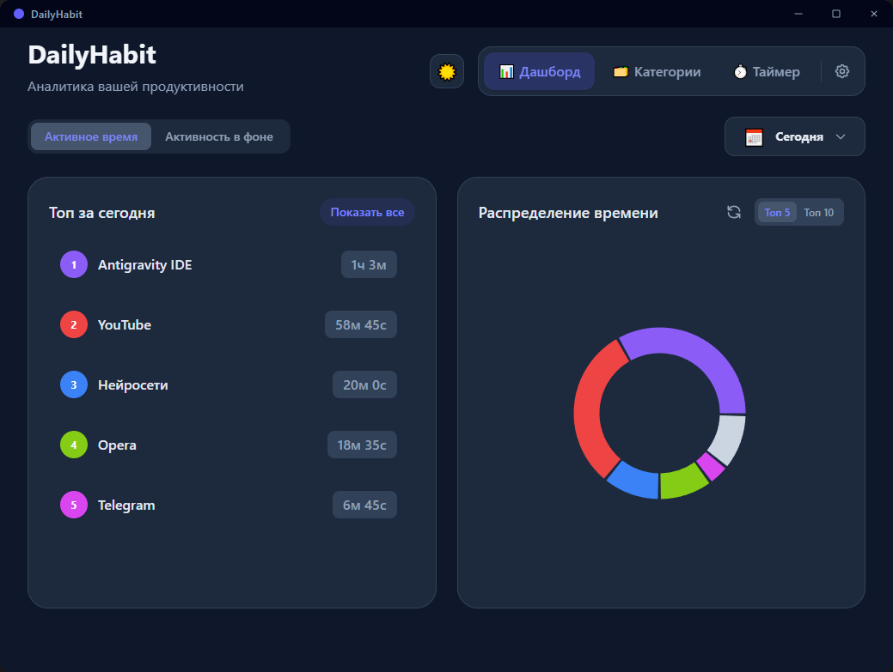
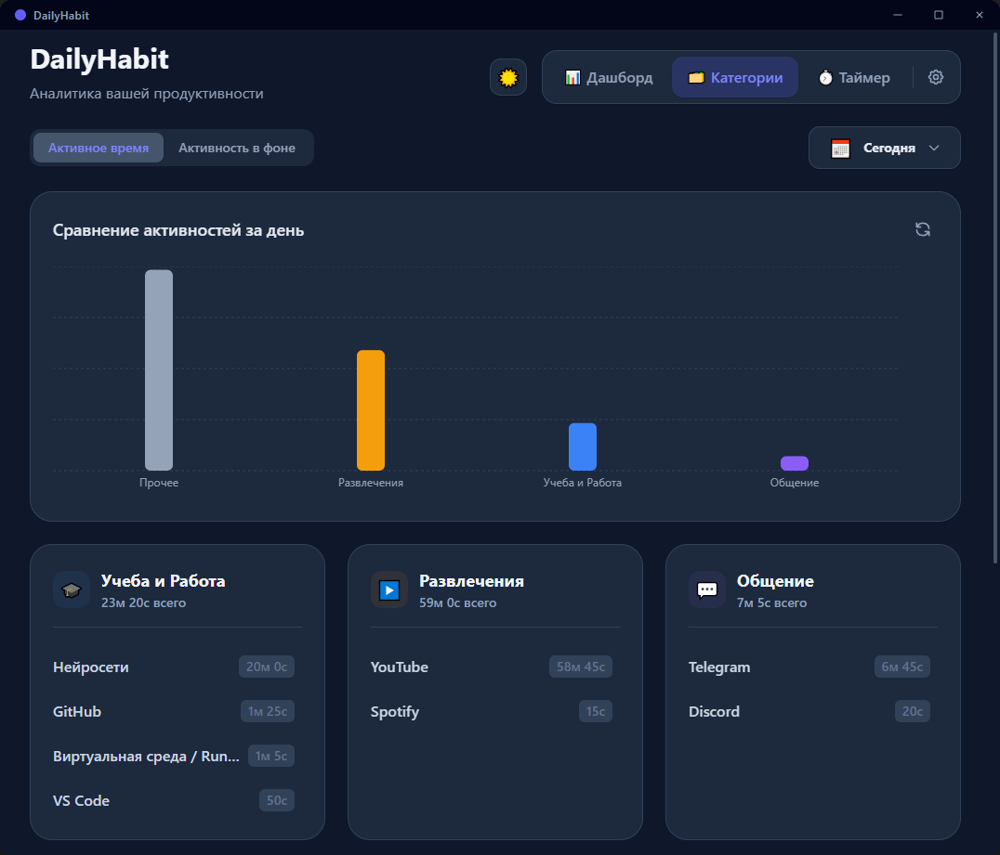
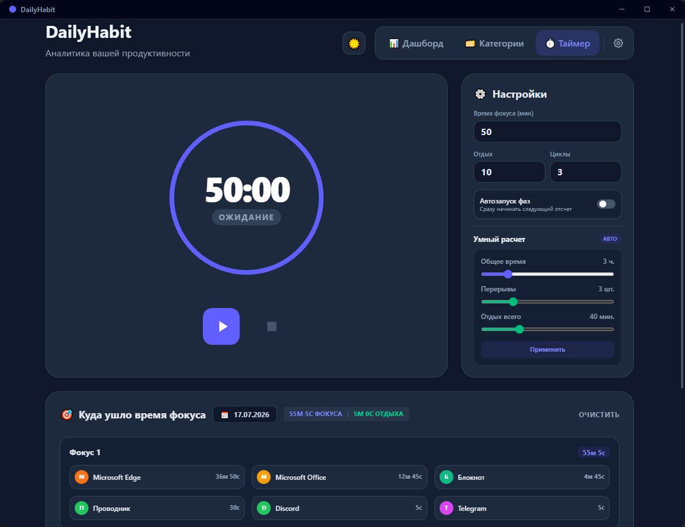

# Dailyhabit

[](https://tauri.app)
[](https://www.rust-lang.org)
[](https://react.dev)
[](https://www.typescriptlang.org)
[](https://www.sqlite.org)
[](https://creativecommons.org/licenses/by-nc/4.0/)

Компактное фоновое приложение под Windows для автоматического учета рабочего времени, категоризации процессов и фокусировки.

Приложение работает в системном трее и предоставляет прозрачный безрамочный интерфейс для просмотра наглядной аналитики и управления сессиями глубокой работы.

---

## 📸 Скриншоты

#### Дашборд активности


#### Категории процессов


#### Таймер фокуса (Pomodoro)


---

## 📊 Потребление ресурсов

- **В фоновом режиме (трей):** ~26 МБ ОЗУ
- **При открытом интерфейсе:** ~30–31 МБ ОЗУ
- **Нагрузка на процессор:** ~0% CPU

---

## 🛠 Технические особенности и архитектура

- **Гибридный стек (Rust + React):**
  - **Бэкенд (Rust):** Опрашивает заголовок активного окна (каждые 5 секунд) и запущенные процессы (раз в минуту). Время рассчитывается через `std::time::Instant` без временного дрифта.
  - **Локальная БД (SQLite):** Статистика активностей и фокус-сессии автоматически сохраняются в SQLite через `rusqlite`.
  - **Фронтенд (React 19 + TypeScript + TailwindCSS v4):** Безрамочный прозрачный UI с интерактивными графиками `Recharts`.
- **Автоматическая категоризация:** Гибкий конфиг `src/rules.json` распределяет приложения и сайты по категориям (разработка, учеба, медиа, игры).
- **Устойчивый таймер фокуса:** Состояние Pomodoro-таймера обрабатывается Rust-бэкендом, поэтому данные не теряются при сворачивании или закрытии окна.
- **Встроенное автообновление:** Поддержка `tauri-plugin-updater` с пользовательским модальным окном обновления.

---

## 📂 Структура проекта

```text
Dailyhabit/
├── docs/
├── public/
├── src/
│   ├── assets/
│   ├── components/
│   ├── rules.json
│   ├── App.tsx
│   └── main.tsx
├── src-tauri/
│   ├── src/
│   │   ├── lib.rs
│   │   └── main.rs
│   ├── Cargo.toml
│   └── tauri.conf.json
├── package.json
├── tsconfig.json
└── vite.config.ts
```

---

## 📥 Скачивание

Готовые исполняемые файлы под Windows доступны на странице [GitHub Releases](https://github.com/Loraness/Dailyhabit/releases).

Для быстрой установки скачайте последнюю версию инсталлятора `dailyhabit_X.X.X_x64-setup.exe` и запустите его.

---

## 🚀 Запуск и сборка из исходников

### Требования
- **Node.js** (v18+)
- **Rust toolchain** (cargo, rustc)

### Разработка
```bash
# 1. Клонировать репозиторий
git clone https://github.com/Loraness/Dailyhabit.git
cd Dailyhabit/dailyhabit

# 2. Установить зависимости
npm install

# 3. Запустить приложение в режиме разработки
npm run tauri dev
```

### Сборка (.exe)
```bash
npm run tauri build
```
Готовый бинарный файл будет помещен в `src-tauri/target/release/bundle/`.

---

## 📜 Лицензия

Этот проект распространяется под некоммерческой лицензией [CC BY-NC 4.0](LICENSE).
